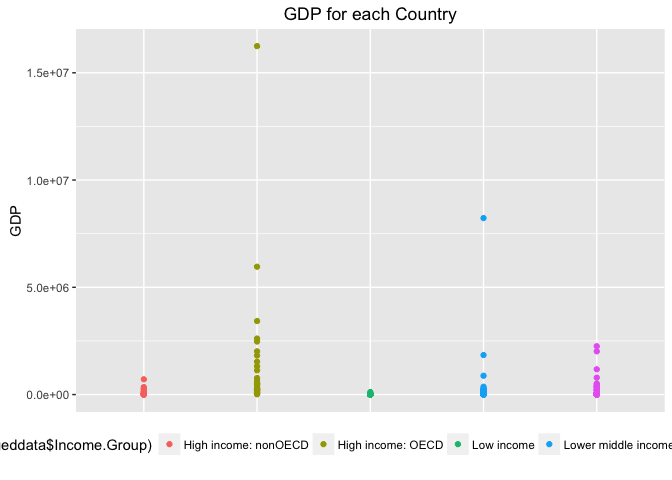

Case Study 1
================
Ruby Vazquez Pena
11/1/2016

Introduction
------------

### We are analyzing 189 countries' economies with confirmed Gross Domestic Product (GDP) estimates (in millions of dollars) and GDP rankings. We seek to analyze whether GPD estimates differ between the 5 income groups that all 189 countries fall into. We will utilize statistics, and visual graphic to analyze and understand the given data.

### Setup and importing the data.

``` r
#Setting my directory to where my data files are located.
setwd("/Users/rubyvazquez/Desktop/SMU/Doing Data Science/Case Study 1")
getwd()
```

    ## [1] "/Users/rubyvazquez/Desktop/SMU/Doing Data Science/Case Study 1"

``` r
#Importing first data file Country.
Country<-read.csv("Country.csv", header = TRUE, sep=",",na.strings=c("", "NA"))
head(Country) #Checking the data.
```

    ##   CountryCode                    Long.Name         Income.Group
    ## 1         ABW                        Aruba High income: nonOECD
    ## 2         ADO      Principality of Andorra High income: nonOECD
    ## 3         AFG Islamic State of Afghanistan           Low income
    ## 4         AGO  People's Republic of Angola  Lower middle income
    ## 5         ALB          Republic of Albania  Upper middle income
    ## 6         ARE         United Arab Emirates High income: nonOECD
    ##                       Region Lending.category Other.groups  Currency.Unit
    ## 1  Latin America & Caribbean             <NA>         <NA>  Aruban florin
    ## 2      Europe & Central Asia             <NA>         <NA>           Euro
    ## 3                 South Asia              IDA         HIPC Afghan afghani
    ## 4         Sub-Saharan Africa              IDA         <NA> Angolan kwanza
    ## 5      Europe & Central Asia             IBRD         <NA>   Albanian lek
    ## 6 Middle East & North Africa             <NA>         <NA>  U.A.E. dirham
    ##   Latest.population.census  Latest.household.survey
    ## 1                     2000                     <NA>
    ## 2           Register based                     <NA>
    ## 3                     1979               MICS, 2003
    ## 4                     1970 MICS, 2001, MIS, 2006/07
    ## 5                     2001               MICS, 2005
    ## 6                     2005                     <NA>
    ##                                                                 Special.Notes
    ## 1                                                                        <NA>
    ## 2                                                                        <NA>
    ## 3 Fiscal year end: March 20; reporting period for national accounts data: FY.
    ## 4                                                                        <NA>
    ## 5                                                                        <NA>
    ## 6                                                                        <NA>
    ##   National.accounts.base.year National.accounts.reference.year
    ## 1                        1995                               NA
    ## 2                        <NA>                               NA
    ## 3                   2002/2003                               NA
    ## 4                        1997                               NA
    ## 5                        <NA>                             1996
    ## 6                        1995                               NA
    ##   System.of.National.Accounts SNA.price.valuation
    ## 1                          NA                <NA>
    ## 2                          NA                <NA>
    ## 3                          NA                 VAB
    ## 4                          NA                 VAP
    ## 5                        1993                 VAB
    ## 6                          NA                 VAB
    ##   Alternative.conversion.factor PPP.survey.year
    ## 1                          <NA>              NA
    ## 2                          <NA>              NA
    ## 3                          <NA>              NA
    ## 4                       1991-96            2005
    ## 5                          <NA>            2005
    ## 6                          <NA>              NA
    ##   Balance.of.Payments.Manual.in.use External.debt.Reporting.status
    ## 1                              <NA>                           <NA>
    ## 2                              <NA>                           <NA>
    ## 3                              <NA>                         Actual
    ## 4                              BPM5                         Actual
    ## 5                              BPM5                         Actual
    ## 6                              BPM4                           <NA>
    ##   System.of.trade Government.Accounting.concept
    ## 1         Special                          <NA>
    ## 2         General                          <NA>
    ## 3         General                  Consolidated
    ## 4         Special                          <NA>
    ## 5         General                  Consolidated
    ## 6         General                  Consolidated
    ##   IMF.data.dissemination.standard
    ## 1                            <NA>
    ## 2                            <NA>
    ## 3                            GDDS
    ## 4                            GDDS
    ## 5                            GDDS
    ## 6                            GDDS
    ##   Source.of.most.recent.Income.and.expenditure.data
    ## 1                                              <NA>
    ## 2                                              <NA>
    ## 3                                              <NA>
    ## 4                                         IHS, 2000
    ## 5                                        LSMS, 2005
    ## 6                                              <NA>
    ##   Vital.registration.complete Latest.agricultural.census
    ## 1                        <NA>                       <NA>
    ## 2                         Yes                       <NA>
    ## 3                        <NA>                       <NA>
    ## 4                        <NA>                    1964-65
    ## 5                         Yes                       1998
    ## 6                        <NA>                       1998
    ##   Latest.industrial.data Latest.trade.data Latest.water.withdrawal.data
    ## 1                     NA              2008                           NA
    ## 2                     NA              2006                           NA
    ## 3                     NA              2008                         2000
    ## 4                     NA              1991                         2000
    ## 5                   2005              2008                         2000
    ## 6                     NA              2008                         2005
    ##   X2.alpha.code WB.2.code           Table.Name           Short.Name
    ## 1            AW        AW                Aruba                Aruba
    ## 2            AD        AD              Andorra              Andorra
    ## 3            AF        AF          Afghanistan          Afghanistan
    ## 4            AO        AO               Angola               Angola
    ## 5            AL        AL              Albania              Albania
    ## 6            AE        AE United Arab Emirates United Arab Emirates

``` r
#Importing second data file GDP.
#Setting column names, for a cleaner import.
names<- c("CountryCode","Ranking", "Delete", "Economy", "GDP","Delete","Delete","Delete","Delete","Delete")
#Importing the second data file with the set column names.
GDPdata<-read.csv("GDP.csv", header = FALSE, sep=",", skip=5, col.names = names,na.strings=c("", "NA"))
head(GDPdata)#Checking the data.
```

    ##   CountryCode Ranking Delete        Economy          GDP Delete.1 Delete.2
    ## 1         USA       1     NA  United States  16,244,600      <NA>       NA
    ## 2         CHN       2     NA          China   8,227,103      <NA>       NA
    ## 3         JPN       3     NA          Japan   5,959,718      <NA>       NA
    ## 4         DEU       4     NA        Germany   3,428,131      <NA>       NA
    ## 5         FRA       5     NA         France   2,612,878      <NA>       NA
    ## 6         GBR       6     NA United Kingdom   2,471,784      <NA>       NA
    ##   Delete.3 Delete.4 Delete.5
    ## 1       NA       NA       NA
    ## 2       NA       NA       NA
    ## 3       NA       NA       NA
    ## 4       NA       NA       NA
    ## 5       NA       NA       NA
    ## 6       NA       NA       NA

``` r
#Cleansing GDP data.
#Deleting columns filled of NAs or blank.
GDPdata$Delete<-NULL
GDPdata$Delete.1<-NULL
GDPdata$Delete.2<-NULL
GDPdata$Delete.3<-NULL
GDPdata$Delete.4<-NULL
GDPdata$Delete.5<-NULL
##I will subset GDP to only the confirmed GDP estimates, which are those with a ranking.
GDPdata<-GDPdata[1:190,]
head(GDPdata)#Checking the data.
```

    ##   CountryCode Ranking        Economy          GDP
    ## 1         USA       1  United States  16,244,600 
    ## 2         CHN       2          China   8,227,103 
    ## 3         JPN       3          Japan   5,959,718 
    ## 4         DEU       4        Germany   3,428,131 
    ## 5         FRA       5         France   2,612,878 
    ## 6         GBR       6 United Kingdom   2,471,784

``` r
##Calculating the Number of missing value from deleting the above variables.
##Deleted 6 variables and each variable has 326 obs.
6*326
```

    ## [1] 1956

### Question 1

#### Merge the data based on the country shortcode. How many of the IDs match?

``` r
#Question 1
#Merge the data based on the country shortcode.
Mergeddata<-merge(Country, GDPdata, by="CountryCode")
head(Mergeddata)
```

    ##   CountryCode                    Long.Name         Income.Group
    ## 1         ABW                        Aruba High income: nonOECD
    ## 2         AFG Islamic State of Afghanistan           Low income
    ## 3         AGO  People's Republic of Angola  Lower middle income
    ## 4         ALB          Republic of Albania  Upper middle income
    ## 5         ARE         United Arab Emirates High income: nonOECD
    ## 6         ARG           Argentine Republic  Upper middle income
    ##                       Region Lending.category Other.groups  Currency.Unit
    ## 1  Latin America & Caribbean             <NA>         <NA>  Aruban florin
    ## 2                 South Asia              IDA         HIPC Afghan afghani
    ## 3         Sub-Saharan Africa              IDA         <NA> Angolan kwanza
    ## 4      Europe & Central Asia             IBRD         <NA>   Albanian lek
    ## 5 Middle East & North Africa             <NA>         <NA>  U.A.E. dirham
    ## 6  Latin America & Caribbean             IBRD         <NA> Argentine peso
    ##   Latest.population.census  Latest.household.survey
    ## 1                     2000                     <NA>
    ## 2                     1979               MICS, 2003
    ## 3                     1970 MICS, 2001, MIS, 2006/07
    ## 4                     2001               MICS, 2005
    ## 5                     2005                     <NA>
    ## 6                     2001                     <NA>
    ##                                                                 Special.Notes
    ## 1                                                                        <NA>
    ## 2 Fiscal year end: March 20; reporting period for national accounts data: FY.
    ## 3                                                                        <NA>
    ## 4                                                                        <NA>
    ## 5                                                                        <NA>
    ## 6                                                                        <NA>
    ##   National.accounts.base.year National.accounts.reference.year
    ## 1                        1995                               NA
    ## 2                   2002/2003                               NA
    ## 3                        1997                               NA
    ## 4                        <NA>                             1996
    ## 5                        1995                               NA
    ## 6                        1993                               NA
    ##   System.of.National.Accounts SNA.price.valuation
    ## 1                          NA                <NA>
    ## 2                          NA                 VAB
    ## 3                          NA                 VAP
    ## 4                        1993                 VAB
    ## 5                          NA                 VAB
    ## 6                        1993                 VAB
    ##   Alternative.conversion.factor PPP.survey.year
    ## 1                          <NA>              NA
    ## 2                          <NA>              NA
    ## 3                       1991-96            2005
    ## 4                          <NA>            2005
    ## 5                          <NA>              NA
    ## 6                       1971-84            2005
    ##   Balance.of.Payments.Manual.in.use External.debt.Reporting.status
    ## 1                              <NA>                           <NA>
    ## 2                              <NA>                         Actual
    ## 3                              BPM5                         Actual
    ## 4                              BPM5                         Actual
    ## 5                              BPM4                           <NA>
    ## 6                              BPM5                         Actual
    ##   System.of.trade Government.Accounting.concept
    ## 1         Special                          <NA>
    ## 2         General                  Consolidated
    ## 3         Special                          <NA>
    ## 4         General                  Consolidated
    ## 5         General                  Consolidated
    ## 6         Special                  Consolidated
    ##   IMF.data.dissemination.standard
    ## 1                            <NA>
    ## 2                            GDDS
    ## 3                            GDDS
    ## 4                            GDDS
    ## 5                            GDDS
    ## 6                            SDDS
    ##   Source.of.most.recent.Income.and.expenditure.data
    ## 1                                              <NA>
    ## 2                                              <NA>
    ## 3                                         IHS, 2000
    ## 4                                        LSMS, 2005
    ## 5                                              <NA>
    ## 6                                         IHS, 2006
    ##   Vital.registration.complete Latest.agricultural.census
    ## 1                        <NA>                       <NA>
    ## 2                        <NA>                       <NA>
    ## 3                        <NA>                    1964-65
    ## 4                         Yes                       1998
    ## 5                        <NA>                       1998
    ## 6                         Yes                       2002
    ##   Latest.industrial.data Latest.trade.data Latest.water.withdrawal.data
    ## 1                     NA              2008                           NA
    ## 2                     NA              2008                         2000
    ## 3                     NA              1991                         2000
    ## 4                   2005              2008                         2000
    ## 5                     NA              2008                         2005
    ## 6                   2001              2008                         2000
    ##   X2.alpha.code WB.2.code           Table.Name           Short.Name
    ## 1            AW        AW                Aruba                Aruba
    ## 2            AF        AF          Afghanistan          Afghanistan
    ## 3            AO        AO               Angola               Angola
    ## 4            AL        AL              Albania              Albania
    ## 5            AE        AE United Arab Emirates United Arab Emirates
    ## 6            AR        AR            Argentina            Argentina
    ##   Ranking              Economy       GDP
    ## 1     161                Aruba    2,584 
    ## 2     105          Afghanistan   20,497 
    ## 3      60               Angola  114,147 
    ## 4     125              Albania   12,648 
    ## 5      32 United Arab Emirates  348,595 
    ## 6      26            Argentina  475,502

``` r
#Number of IDs that matched
dim(Mergeddata)[1]
```

    ## [1] 189

#### Even though both datasets had different dimensions, we were able to merge them into a dataset of 189 rows and 35 columns

### Question 2

#### Sort the data frame in ascending order by GDP (so United States is last). What is the 13th country in the resulting data frame?

``` r
#Question 2
##Converting GDP values to numeric values.
Mergeddata$GDP<-as.character(Mergeddata$GDP)
Mergeddata$GDP<-as.numeric(gsub(",", "", Mergeddata$GDP))
##Sorting data by GDP.
Sorteddata<-Mergeddata[order(Mergeddata$GDP),]
#The 13th country on the list
Sorteddata[13,1:2]
```

    ##    CountryCode           Long.Name
    ## 93         KNA St. Kitts and Nevis

### From the above we can see that after sorting, St. Kitts and Nevis is the 13th country on our list

### Question 3

#### What are the average GDP rankings for the "High income: OECD" and "High income: nonOECD" groups?

``` r
#Question 3
#Subsetting the data where Income group equal High income: OECD and taking the mean.
mean(as.numeric(as.character(Mergeddata[Mergeddata$Income.Group =="High income: OECD",]$Ranking)))
```

    ## [1] 32.96667

``` r
#Subsetting the data where Income group equal High income: nonOECD and taking the mean.
mean(as.numeric(as.character(Mergeddata[Mergeddata$Income.Group =="High income: nonOECD",]$Ranking)))
```

    ## [1] 91.91304

#### From above, we know that the average between income groups, High income: OECD and High income: nonOECD differ by significantly.

### Question 4

#### Plot the GDP for all of the countries. Use ggplot2 to color your plot by Income Group.

``` r
#Question 4
#Making sure I have ggplot2 installed.
library("ggplot2")
#Plotting GDP for all countries by Income.Group.
ggplot(Mergeddata, aes(Income.Group, GDP),labels)+geom_point(aes(colour= factor(Mergeddata$Income.Group)))+
 ggtitle("GDP for each Country")+ theme(axis.title.x=element_blank(), axis.text.x=element_blank(),axis.ticks.x=element_blank())+
  theme(legend.position="bottom")
```



#### The graph above illustrates the variance in the GDP estimate each income group. We can see that the group High Income: OECD has more extreme values than all the other groups. We can also see that the Low Income group has GDP relatively near 0.

### Question 5

#### Cut the GDP ranking into 5 separate quantile groups. Make a table versus Income.Group.How many countries are Lower middle income but among the 38 nations with highest GDP?

``` r
#Question 5
##Making the 5 quartiles.
breaks <- quantile(as.numeric(as.character(Mergeddata$Ranking)), probs = seq(0, 1, 0.2), na.rm = TRUE)
##Making the quartiles a column in the data.
Mergeddata$quantileGDP <- cut(as.numeric(as.character(Mergeddata$Ranking)), breaks = breaks)
##Selecting the data that has Income.Group equal to Lower middle income.
x<-Mergeddata[Mergeddata$Income.Group=="Lower middle income",]
#Getting the number of countries in the Lower middle income group that are in each quartile.
by(x, x$quantileGDP, nrow)
```

    ## x$quantileGDP: (1,38.6]
    ## [1] 5
    ## -------------------------------------------------------- 
    ## x$quantileGDP: (38.6,76.2]
    ## [1] 13
    ## -------------------------------------------------------- 
    ## x$quantileGDP: (76.2,114]
    ## [1] 11
    ## -------------------------------------------------------- 
    ## x$quantileGDP: (114,152]
    ## [1] 9
    ## -------------------------------------------------------- 
    ## x$quantileGDP: (152,190]
    ## [1] 16

Conclusion
----------

### From the analysis above we can see the group High income: OECD has a greater variance in GDP estimates than any other group, yet has a low mean ranking. We also found out that more Lower middle income country economies are in the higher quartile of GDP estimates. We found the mean ranking for groups High income: OECD and High income: nonOECD are 32.9667 and 91.91 respectively. Note that the USA has the highest GDP estimate and is ranked 1, and we can view it in the provided graph as the highest data point in the High income: OECD group.
